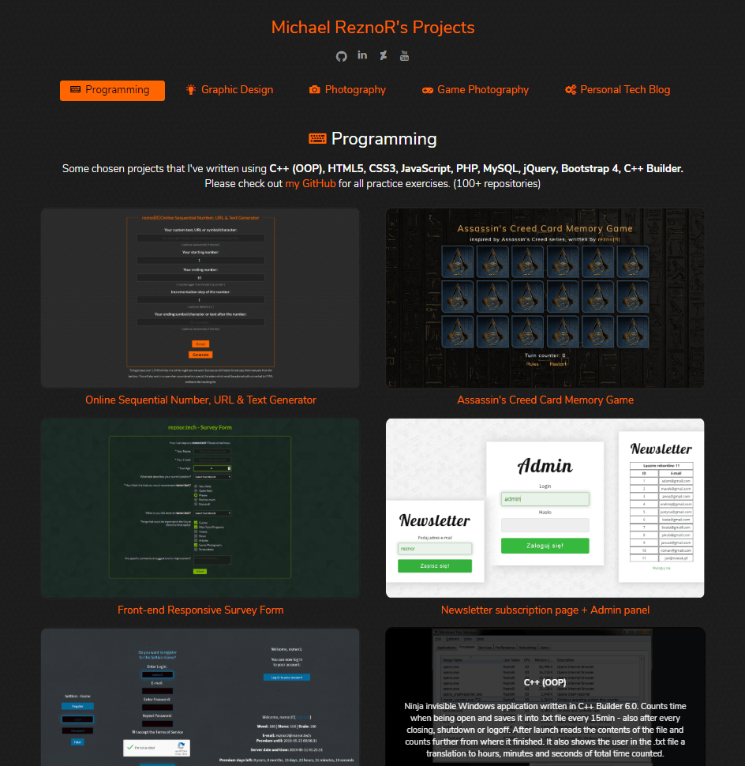

# HTML/CSS/JavaScript - Personal Portfolio

> Personal portfolio which I've written in HTML/CSS/JavaScript. Reads all projects data from .json file and generates them real-time on the page.

## Table of contents

* [General info](#general-info)
* [Screenshots](#screenshots)
* [Technologies](#technologies)
* [Features](#features)
* [Contact](#contact)

## General info

Personal portfolio which I've written in HTML/CSS/JavaScript. Includes 5 categories: Programming, Graphics Design, Photography, Game Photography, Personal Technology Blog.

This whole page is only a single .html file. I've written a script in JavaScript that automatically generates the thumbnails, titles, descriptions, links and contents of all the categories from a single .JSON file and using a single function - just because I always wanted to learn how to do it.

You only need to click a button from one of the 5 categories and the script will take care of the rest.
If you wish to go back to this intro text, just click the "Michael ReznoR's Projects" text at the top or reload the page.

Have fun! :)

## Screenshots

## Technologies

* HTML5
* CSS
* JavaScript
* Bootstrap 4
* JSON
* jQuery 3.4.1
* html5shiv 3.7.3
* Google Fonts

## Features

* Reads all projects data (titles, description, links, class names) from a single .json file (multi-level array)
* Generates all project thumbnails real-time on the page using a single function after clicking the appriopriate category button
* Script checks how many elements there are in the array (how many projects in the current category), and generates the exact amount
* Fully mobile responsive (Bootstrap 4)
* Includes links to live-versions (if possible)
* Cookie warning ( [CookieAlert v1.2](http://cookiealert.sruu.pl/) by [Paweł Klockiewicz](http://klocus.pl/) )
* Icons from fontello
* CSS Reset
* Google Analytics

## Contact

Written by [ReznoRMichael](https://github.com/ReznoRMichael)
